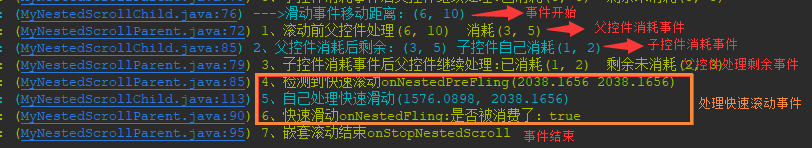

CoordinatorLayout
https://developer.android.google.cn/reference/android/support/design/widget/CoordinatorLayout.html

https://blog.csdn.net/briblue/article/details/73076458

## 简介

> CoordinatorLayout是一个超级强大的FrameLayout（其实并非FrameLayout而是继承自ViewGroup），它主要用于两个用例：
  1. 作为应用的顶层布局，也就是作为一个普通的顶层容器
  2. 作为与一个或多个子控件进行特定交互的容器，通过为其子控件指定Behavior，可以在单个父视图中提供许多不同的交互，并且这些子控件也可以相互交互。

&emsp;&emsp;从上得知CoordinatorLayout其实是一个可以通过Behavior来实现其与子控件以及子控件之间多种交互行为的容器，那接下来看看Behavior是个什么东西。

> Behavior是CoordinatorLayout子控件的交互行为插件，它实现了一个或多个交互，这些交互可能包括拖拽、快速滑动或任何其他手势。
  可以用来实现各种交互和额外的布局修改。如果某个子控件需要交互，请定义类继承Behavior，实现交互，然后将它设置给子控件。

&emsp;&emsp;可以通过下面三种方式为子空间设置Behavior插件：

－ 在xml文件中设置属性
```Xml
app:layout_behavior="@string/xxx 或者com.openxu.behavior.TestBehavior"`
<--这个属性接受一个字符串，该字符串就是对应Behavior类的路径-->
```

－ 在代码中设置

```Java
CoordinatorLayout.LayoutParams layoutParams = (CoordinatorLayout.LayoutParams) childView.getLayoutParams();
layoutParams.setBehavior(new TestBehavior());
```

- 通过注解

```Java
@CoordinatorLayout.DefaultBehavior(AppBarLayout.Behavior.class)
public class AppBarLayout extends LinearLayout {}
```
&emsp;&emsp;Behavior有两个构造方法，一个无参的，一个有两个参数，和View一样，不同的创建方式会调用不同的构造方法，
用第一种方式设置将调用两个参数的构造方法，而使用后面两种方式将调用无参构造方法。
&emsp;&emsp;Behavior只能设置给CoordinatorLayout的直接子控件，因为`app:layout_behavior`是CoordinatorLayout的布局属性，
只有CoordinatorLayout才能解析。

## 自定义Behavior

### 单个子控件的交互

&emsp;&emsp; 自定义Behavior需要继承CoordinatorLayout.Behavior<V extends View>，传入的泛型是指这个Behavior最终会设置给什么类型的控件。
比如下面的实例中，我为TextView定义一个Behavior，则泛型为TextView。你希望任何控件都能设置该Behavior，那泛型为View即可。需要注意的是，Behavior
中所有方法的参数child就是被设置了该Behavior的子控件。
```xml
<androidx.coordinatorlayout.widget.CoordinatorLayout
    android:layout_width="match_parent"
    android:layout_height="match_parent">
    <TextView
        android:id="@+id/tv_1"
        android:layout_width="100dp"
        android:layout_height="50dp"
        android:textColor="@color/color_white"
        android:background="#ff0000"
        android:gravity="center"
        android:layout_margin="50dp"
        android:clickable="true"
        app:layout_behavior="com.fpc.common.behavior.TextBehavior"
        android:text="文字1"/>
</androidx.coordinatorlayout.widget.CoordinatorLayout>
```

```Java
public class TextBehavior extends CoordinatorLayout.Behavior<TextView> {
    public TextBehavior() {
        super();
        FLog.i("无参数构造方法");
    }
    public TextBehavior(Context context, AttributeSet attrs) {
        super(context, attrs);
        FLog.i("两个参数构造方法");
    }
    //当CoordinatorLayout测量child的时候调用，如果这个方法返回了true，则不会调用child的measure()方法
    @Override
    public boolean onMeasureChild(CoordinatorLayout parent, TextView child, int parentWidthMeasureSpec, int widthUsed, int parentHeightMeasureSpec, int heightUsed) {
        FLog.i("测量：onMeasureChild  child="+child);
        return super.onMeasureChild(parent, child, parentWidthMeasureSpec, widthUsed, parentHeightMeasureSpec, heightUsed);
    }
    //当CoordinatorLayout给child布局的时候调用
    @Override
    public boolean onLayoutChild(CoordinatorLayout parent, TextView child, int layoutDirection) {
        FLog.i("布局：onLayoutChild  child="+child);
        return super.onLayoutChild(parent, child, layoutDirection);
    }
    //当CoordinatorLayout将事件发送给child之前会调用此方法。如果Behavior希望拦截并接管事件流，则返回true。默认值总是返回false。
    @Override
    public boolean onInterceptTouchEvent(CoordinatorLayout parent, TextView child, MotionEvent ev) {
        FLog.i("事件拦截：onInterceptTouchEvent");
        return false;
    }
    // child的触摸事件响应之前会调用此方法，如果Behavior想要处理事件，应该返回true，默认返回false
    @Override
    public boolean onTouchEvent(CoordinatorLayout parent, TextView child, MotionEvent ev) {
        FLog.i("事件：onTouchEvent");
        return false;
    }
}
```

运行结果如下:


如果将TextBehavior的onInterceptTouchEvent()方法返回true，表示Behavior会拦截事件，那么child将不能响应事件，执行结果如下：


&emsp;&emsp;在示例中，我们重写了Behavior中的一些方法，这些方法是关于View的测量、布局、事件的一些方法，而且从方法的注释可大概猜测，Behavior是通过“拦截”
来是些交互的，也就是说Behavior可以拦截View的测量、布局和事件，如果Behavior在这些事件中返回了true，则表示Behavior代替child做了这些工作，child不会再去执行其
onMeasure()、onLayout()、onTouchEvent()等方法。同个一个例子证实我们的猜测，请看下面的布局：
```xml
    <androidx.coordinatorlayout.widget.CoordinatorLayout
        android:layout_width="match_parent"
        android:layout_height="match_parent">
        <!--第一部分-->
        <com.google.android.material.appbar.AppBarLayout
            android:id="@+id/app_bar"
            android:layout_width="match_parent"
            android:layout_height="wrap_content"
            app:elevation="0dp">
            <ImageView
                android:layout_width="match_parent"
                android:layout_height="200dp"
                android:background="@mipmap/common_bg_big_title"
                android:fitsSystemWindows="true"
                android:scaleType="fitXY"
                app:layout_collapseMode="parallax"
                app:layout_collapseParallaxMultiplier="0.7" />
        </com.google.android.material.appbar.AppBarLayout>
        <!--第二部分-->
        <androidx.core.widget.NestedScrollView
            android:layout_width="match_parent"
            android:layout_height="match_parent"
            android:background="#5500ffff"
            app:layout_behavior="@string/appbar_scrolling_view_behavior"><!--设置Behavior-->
            <LinearLayout
                android:layout_width="match_parent"
                android:layout_height="match_parent"
                android:orientation="vertical">
                <LinearLayout
                    android:id="@+id/ll_content"
                    android:layout_width="match_parent"
                    android:layout_height="match_parent"
                    android:orientation="vertical"/>
                <TextView
                    android:id="@+id/tv_logout"
                    style="@style/btn_red"
                    android:layout_marginTop="20dp"
                    android:layout_marginBottom="500dp"
                    android:text="退出登录"/>
            </LinearLayout>
        </androidx.core.widget.NestedScrollView>
    </androidx.coordinatorlayout.widget.CoordinatorLayout>
```


&emsp;&emsp;在上面的布局中，CoordinatorLayout有两个直接子控件AppBarLayout、NestedScrollView，
之前说过CoordinatorLayout继承自ViewGroup，它的布局方式跟Fragment一样，一层层叠加上去，那为什么NestedScrollView显示在AppBarLayout的下面？
就是因为我们为NestedScrollView设置了一个Behavior，如果不设置，NestedScrollView将会叠加在AppBarLayout之上显示：


&emsp;&emsp;我们进一步查看CoordinatorLayout的onLayout()方法会发现上卖弄的猜测都是正确的，而在CoordinatorLayout的onMeasure()、onInterceptTouchEvent()等方法中也会有相同的逻辑：
```Java
@Override
protected void onLayout(boolean changed, int l, int t, int r, int b) {
    final int layoutDirection = ViewCompat.getLayoutDirection(this);
    final int childCount = mDependencySortedChildren.size();
    for (int i = 0; i < childCount; i++) {
        final View child = mDependencySortedChildren.get(i);
        if (child.getVisibility() == GONE) {
            // If the child is GONE, skip...
            continue;
        }
        final LayoutParams lp = (LayoutParams) child.getLayoutParams();
        final Behavior behavior = lp.getBehavior();  //获取child的Behavior对象
        /*
         * 关键逻辑：
         * 如果child设置了behavior，先调用behavior.onLayoutChild()方法
         * 如果behavior.onLayoutChild()返回true，则表示behavior完成了child的布局
         * 如果behavior.onLayoutChild()返回false，则表示behavior没有为child布局，会继续调用onLayoutChild()方法完成CoordinatorLayout的默认布局（一层层叠加）
         */
        if (behavior == null || !behavior.onLayoutChild(this, child, layoutDirection)) {
            onLayoutChild(child, layoutDirection);
        }
    }
}
```

### 多个子控件的交互

&emsp;&emsp;在上面单个子控件(子控件只有一个TextView)的交互示例中，我们知道了Behavior的工作原理，CoordinatorLayout中会拦截child的测量、布局、事件交给child的behavior处理，如果behavior处理了（相应方法返回true），则不会调用child的相关方法，如果没有处理，则让child去接管。
突然发现 [自定义控件](https://blog.csdn.net/u010163442/column/info/14247) 都可以以Behavior插件的方式实现了，当然这么做没有必要，Behavior真正的意义在于协调多个子控件的交互，多控件交互依靠下面三个方法让子控件间产生关联：
- **layoutDependsOn()** 确定子控件是否以另一个控件作为依赖项
- **onDependentViewChanged()** 被依赖的控件发生尺寸和位置变化时调用
- **onDependentViewRemoved()** 被依赖的控件被移除

&emsp;&emsp;下面的示例演示一个TextView和一个Button的交互，Button跟随手指移动，TextView跟随Button移动：
```Java
public class ButtonBehavior extends CoordinatorLayout.Behavior<Button> {
    public ButtonBehavior() {
        super();
    }
    public ButtonBehavior(Context context, AttributeSet attrs) {
        super(context, attrs);
    }
    @Override
    public boolean onInterceptTouchEvent(CoordinatorLayout parent, Button child, MotionEvent ev) {
        return true; //返回true表示将Button的事件委托给ButtonBehavior处理
    }
    @Override
    public boolean onTouchEvent(CoordinatorLayout parent, Button child, MotionEvent ev) {
        if(ev.getAction()==MotionEvent.ACTION_DOWN || ev.getAction()==MotionEvent.ACTION_MOVE) {
            //处理Button的事件，让其跟随手指移动
            child.setTranslationX(ev.getX());
            child.setTranslationY(ev.getY());
        }
        return true;
    }
}
```

```Java
public class TextBehavior extends CoordinatorLayout.Behavior<TextView> {
    public TextBehavior() {
        super();
    }
    public TextBehavior(Context context, AttributeSet attrs) {
        super(context, attrs);
    }
    /**
     * 确定child（设置了该Behavior的控件）是否让dependency（另一个同级子控件）作为布局依赖项，
     * 这个方法将至少调用一次以响应布局请求，如果返回true则将给定的子控件dependency作为依赖控件
     */
    @Override
    public boolean layoutDependsOn(@NonNull CoordinatorLayout parent, @NonNull TextView child, @NonNull View dependency) {
        //如果dependency的类型是Button，则将他作为依赖
        return dependency instanceof Button;
    }
    /**
     * 当被依赖的控件dependency发生尺寸或位置变化时都会调用此方法，
     * 可以在此更新子控件,如果更新了子控件，请返回true
     */
    @Override
    public boolean onDependentViewChanged(@NonNull CoordinatorLayout parent, @NonNull TextView child, @NonNull View dependency) {
        //当Button位置变化时，让TextView跟着移动
        child.setTranslationX(dependency.getX()+50);
        child.setTranslationY(dependency.getY()+dependency.getHeight()+50);
        return true;
    }
    /**
     * 当dependency被移除出容器时调用此方法
     */
    @Override
    public void onDependentViewRemoved(@NonNull CoordinatorLayout parent, @NonNull TextView child, @NonNull View dependency) {
        super.onDependentViewRemoved(parent, child, dependency);
    }
}
```

```XML
<androidx.coordinatorlayout.widget.CoordinatorLayout
    android:layout_width="match_parent"
    android:layout_height="match_parent">
    <Button
        android:layout_width="wrap_content"
        android:layout_height="wrap_content"
        app:layout_behavior="com.fpc.common.behavior.ButtonBehavior"
        android:layout_margin="20dp"
        android:text="拖我吖"/>
    <TextView
        android:id="@+id/tv_1"
        android:layout_width="100dp"
        android:layout_height="50dp"
        android:textColor="@color/color_white"
        android:background="#ff0000"
        android:gravity="center"
        android:clickable="true"
        app:layout_behavior="com.fpc.common.behavior.TextBehavior"
        android:text="跟随Button"/>
</androidx.coordinatorlayout.widget.CoordinatorLayout>
```

运行如下：

&emsp;&emsp;示例中，我们为Button设置了一个Behavior，让Behavior接管Button的事件，当手指移动时，设置Button的位置为手指的位置来实现拖动。
另外我们为TextView也设置了一个Behavior，将Button作为依赖项，当Button的尺寸和位置发生变化时，动态改变TextView的位置，实现TextView跟随Button移动。

&emsp;&emsp;多个子控件的交互最主要的就是设置依赖项，这里类似观察者模式，TextView将Button作为依赖项，Button就成为被观察者，TextView作为观察者观察Button的变化而响应变化。
通过这种机制，我们可以实现很多特效。


### 嵌套滚动

#### 概念
##### 5.0以上版本
&emsp;&emsp;嵌套滚动故名思意就是，父控件需要滚动，子控件也需要滚动，比如ScrollView中嵌套RecyclerView，这种情况就是嵌套滚动，
当然这里只是举一个栗子，最好避免这种布局方式。嵌套滚动到底能解决什么问题，我们后面再去讨论，先看看它到底是个什么东西，带来了什么新功能。
细心的同学可能发现在android 5.0以上版本中View和ViewGroup的源码中多了一些方法，这些方法名都带有`NestedScroll`的字样，这就为了支持嵌套滚动而添加的方法，
也就是说5.0以上的控件默认支持嵌套滚动（不是默认开启），这些方法如下：
```Java
//android 5.0及以上版本View源码添加的方法：
public void setNestedScrollingEnabled(boolean enabled);
public boolean isNestedScrollingEnabled();
public boolean startNestedScroll(int axes);
public void stopNestedScroll();
public boolean hasNestedScrollingParent();
public boolean dispatchNestedScroll(int dxConsumed, int dyConsumed, int dxUnconsumed, int dyUnconsumed, int[] offsetInWindow);
public boolean dispatchNestedPreScroll(int dx, int dy, int[] consumed, int[] offsetInWindow);
public boolean dispatchNestedFling(float velocityX, float velocityY, boolean consumed);
public boolean dispatchNestedPreFling(float velocityX, float velocityY);

//android 5.0及以上版本ViewGroup源码添加的方法：
public boolean onStartNestedScroll(View child, View target, int nestedScrollAxes);
public void onNestedScrollAccepted(View child, View target, int nestedScrollAxes);
public void onStopNestedScroll(View target);
public void onNestedScroll(View target, int dxConsumed, int dyConsumed, int dxUnconsumed, int dyUnconsumed);
public void onNestedPreScroll(View target, int dx, int dy, int[] consumed);
public boolean onNestedFling(View target, float velocityX, float velocityY, boolean consumed);
public boolean onNestedPreFling(View target, float velocityX, float velocityY);
public int getNestedScrollAxes();
```

##### 5.0以下版本
&emsp;&emsp;上面说到5.0以上版本已经实现了嵌套滚动相关功能，那5.0一下怎么办呢？可以通过下面四个类来做兼容
- `NestedScrollingParent` 嵌套滚动父控件需要实现此接口
- `NestedScrollingParentHelper` 嵌套滚动父控件帮助类
- `NestedScrollingChild` 嵌套滚动子控件需要实现此接口
- `NestedScrollingChildHelper` 嵌套滚动子控件帮助类
&emsp;&emsp;`NestedScrollingParent`、`NestedScrollingChild`这两个接口分别对应ViewGroup和View中新增的方法，
在5.0以下版本中要实现嵌套滚动，就需要实现这些方法，这些方法的作用就是让嵌套滚动的子控件和父控件产生关联，实现起来当然不是简单事，
所以出现了`NestedScrollingParentHelper`、`NestedScrollingChildHelper`这两个帮助类，帮助类已经帮我们实现了这些功能，我们实现接口的时候
重写方法只需要调用帮助类的同名方法即可。当然我们在使用嵌套滚动之前先看一下这些方法都是干嘛的：

##### NestedScrollingParent接口方法说明
/**
 * NestedScrollingParent应该被希望支持嵌套滚动的ViewGroup的子类实现，
 * 实现这个接口应该创建一个NestedScrollingParentHelper的实例helper，并将接口中方法委托给helper相同的方法。
 *
 * 5.0以上版本的ViewGroup已经通过ViewGroupCompat实现了接口中的方法，所以默认支持嵌套滚动
 * 注意：如果您的应用最低支持版本低于5.0，应该重写NestedScrollingParent所有方法委托给NestedScrollingParentHelper的同名方法处理
 */
public interface NestedScrollingParent {
    /**
     * 对启动可嵌套滚动的子代控件的startNestedScroll(View, int)方法做出响应，视图层次结构上每个父级都有机会通过返回true来响应和声明嵌套滚动操作
     * 该方法由ViewParent重写，以指示视图愿意支持即将开始的嵌套滚动操作，如果返回true，则在持续时间内，此父控件将成为目标子控件的嵌套滚动父级
     * 嵌套滚动完成后，此ViewParent将收到onStopNestedScroll()的回调，表示嵌套滚动完成
     * @param child ：包含目标子控件（target）的直接子容器，也就是说target不一定是ViewParent的直接子控件，可以支持多级嵌套
     * @param target ：启动了嵌套滚动的目标子控件
     * @param axes ：由ViewCompat.SCROLL_AXIS_HORIZONTAL和ViewCompat.SCROLL_AXIS_VERTICAL组成的轴来表示滚动的方向，可在此过滤某个方向上的嵌套滚动，
     * @return :如果返回true，则表示此ViewParent接受嵌套滚动操作
     *
     */
    boolean onStartNestedScroll(@NonNull View child, @NonNull View target, @ScrollAxis int axes);
    /**
     * 对嵌套滚动操作的成功声明做出反应，这个方法将在onStartNestedScroll()返回true后调用。
     * 它为视图及其超类提供了执行嵌套滚动的初始配置的机会，如果存在超类，则此方法的实现应始终调用其超类对此方法的实现
     * @param child ：包含target的直接父级
     * @param target ：启动了嵌套滚动的目标子控件
     * @param axes ：由ViewCompat.SCROLL_AXIS_HORIZONTAL、ViewCompat.SCROLL_AXIS_VERTICAL组成的标识
     */
    void onNestedScrollAccepted(@NonNull View child, @NonNull View target, @ScrollAxis int axes);

    /**
     * 此方法在嵌套滚动停止时调用，以响应嵌套滚动操作的结束，比如MotionEvent.ACTION_UP或者MotionEvent.ACTION_CANCEL.
     * 可在嵌套滚动操作后执行清理工作。
     * @param target：
     */
    void onStopNestedScroll(@NonNull View target);

    /**
     * 在target滚动之前调用，ViewParent可以在target滚动之前滚动。
     * target的dispatchnestedpescroll()方法回调此方法。
     * 如果ViewParent消耗了部分滚动，应该通过consumed告诉子控件，其中consumed[0]表示x轴方向已消费的滚动，consumed[1]表示y轴方向已消费的滚动
     *
     * @param target:
     * @param dx : 水平滚动距离（像素）
     * @param dy : 垂直滚动距离（像素）
     * @param consumed ： 被父控件消费了的水平、垂直滚动距离
     */
    void onNestedPreScroll(@NonNull View target, int dx, int dy, @NonNull int[] consumed);

    /**
     * 当ViewParent的当前嵌套滚动子视图分派嵌套滚动事件时，将调用此方法对正在进行的嵌套滚动做出反应
     * onStartNestedScroll()必须返回true，才能接受到此方法的调用
     *
     * 子控件滚动距离的消耗和未消耗的部分都会报告给ViewParent。
     * 可以使用消耗的部分跟踪多个子控件的滚动位置。
     * 未消耗部分可以被ViewParent消费
     *
     * @param target ：支持嵌套滚动的子控件
     * @param dxConsumed ：子控件已消耗的水平滚动距离
     * @param dyConsumed ：子控件已消耗的竖直滚动距离
     * @param dxUnconsumed ：子控件未消耗的水平滚动距离
     * @param dyUnconsumed ：子控件未消耗的竖直滚动距离
     */
    void onNestedScroll(@NonNull View target, int dxConsumed, int dyConsumed,
            int dxUnconsumed, int dyUnconsumed);
    /**
     * 目标子控件在快速滚动之前调用，该方法表明子控件检测到了一个具有给定速度的快速滚动。
     * @param target 嵌套滚动子控件
     * @param velocityX 水平速度（像素/秒）
     * @param velocityY 垂直速度（像素/秒）
     * @return true 如果ViewParent希望消耗快速滚动，请返回true
     */
    boolean onNestedPreFling(@NonNull View target, float velocityX, float velocityY);

    /**
     * 发生快速滚动时调用
     * 当触摸屏滚动速度超过ViewConfiguration.getScaledMinimumFlingVelocity()阈值时调用
     * @param target
     * @param velocityX：水平速度（像素/秒）
     * @param velocityY：竖直速度（像素/秒）
     * @param consumed ：子控件是否消费了快速滑动事件
     * @return : 如果父控件消费了快速滚动时间，请返回true
     */
    boolean onNestedFling(@NonNull View target, float velocityX, float velocityY, boolean consumed);
    /**
     * 返回此嵌套滚动ViewParent的当前滚动轴
     * ViewCompat.CROLL_AXIS_HORIZONTAL
     * ViewCompat.SCROLL_AXIS_VERTICAL
     * ViewCompat.SCROLL_AXIS_NONE
     */
    @ScrollAxis
    int getNestedScrollAxes();
}

##### NestedScrollingChild接口方法说明
/**
 * 如果子控件希望将嵌套滚动操作分派给父控件（实现了NestedScrollingParent），该接口应该由View的子类实现
 * 实现这个接口应该创建一个NestedScrollingChildHelper的实例helper，并将接口中方法委托给helper的同名方法。
 *
 * 5.0以上版本的View已经通过ViewCompat实现了接口中的方法，所以默认支持嵌套滚动
 * 注意：如果您的应用最低支持版本低于5.0，应该重写NestedScrollingChild所有方法委托给NestedScrollingChildHelper的同名方法处理
 */
public interface NestedScrollingChild {
    /**为此控件启用或禁用嵌套滚动*/
    void setNestedScrollingEnabled(boolean enabled);
    /**
     * 判断此控件是否启用了嵌套滚动，如果启用了将返回true
     * 如果启用了嵌套滚动，并且此控件类支持嵌套滚动，则控件将在适用时充当嵌套滚动子控件，也就是target，将有关正在进行的滚动操作数据派发给支持嵌套滚动的父级
     */
    boolean isNestedScrollingEnabled();
    /**
     * 沿着给定的轴开始嵌套滚动操作，该方法最终会调用NestedScrollingParent.onStartNestedScroll()
     */
    boolean startNestedScroll(@ScrollAxis int axes);
    /**嵌套滚动结束*/
    void stopNestedScroll();

    /**判断是否有对应的嵌套滚动父级*/
    boolean hasNestedScrollingParent();
    /**
     * 在子控件消费滚动事件之前，将事件分派给父控件
     * 为嵌套滚动操作中的父控件提供一个机会，以便在子控件处理事件之前消费部分或全部的滚动操作
     * @param dx ：水平滚动距离（像素）
     * @param dy ：垂直滚动距离（像素）
     * @param consumed ：被消耗的距离，此处consumed数组值都为0
     * @param offsetInWindow Optional. 如果不为空，返回时将包含此视图本地视图坐标中的偏移量，从操作之前到操作完成之后。视图实现可以使用它来调整预期的输入坐标跟踪。
     * @return true if the parent consumed some or all of the scroll delta
     * @see #dispatchNestedScroll(int, int, int, int, int[])
     */
    boolean dispatchNestedPreScroll(int dx, int dy, @Nullable int[] consumed,
            @Nullable int[] offsetInWindow);

    /**
     * 向支持嵌套滚动的父级报告当前控件有关正在进行的滚动的信息
     * 通常在子控件消费事件之后通知父控件是否还有未消费的事件
     * @param dxConsumed : 在此滚动步骤中此视图消耗的水平距离（以像素为单位）
     * @param dyConsumed : 在此滚动步骤中，此视图使用的垂直距离（以像素为单位）
     * @param dxUnconsumed 未使用的水平滚动距离（像素），此视图未使用
     * @param dyUnconsumed 未使用的垂直滚动距离（像素），此视图未使用
     * @param offsetInWindow Optional. 如果不为空，返回时将包含此视图本地视图坐标中的偏移量，从操作之前到操作完成之后。视图实现可以使用它来调整预期的输入坐标跟踪。
     * @return true 如果时间派发成功，返回true
     */
    boolean dispatchNestedScroll(int dxConsumed, int dyConsumed,
            int dxUnconsumed, int dyUnconsumed, @Nullable int[] offsetInWindow);
    /**
     * 在子控件消费之前向嵌套滚动父控件派发一个快速滑动事件
     * @param velocityX 水平速速（像素/秒）
     * @param velocityY 垂直速度
     * @return 如果父控件消费了滚动事件，返回true
     */
    boolean dispatchNestedPreFling(float velocityX, float velocityY);
    /**
     * 向嵌套滚动父控件派发一个快速滑动事件
     * @param velocityX 水平速速（像素/秒）
     * @param velocityY 垂直速度
     * @param consumed 如果子控件消费了快速滑动事件，传true
     * @return 如果父控件消费了滚动事件，返回true
     */
    boolean dispatchNestedFling(float velocityX, float velocityY, boolean consumed);
}

##### 总结
&emsp;&emsp;上面特么都是些什么东西？有什么鸡儿用？能特么搞个栗子看看吗？
&emsp;&emsp;确实没鸡儿用，看一下就行了，你只要知道嵌套滚动有两个东西，一个父级控件，一个子控件，5.0以上版本默认实现了嵌套滚动，
5.0以下版本需要让这两个东西各自实现接口，接口方法实现调用Helper的同名方法就行了，注意：千万不要调用super.xxx()。

#### 示例
&emsp;&emsp;该示例中有两个自定义控件，`MyNestedScrollChild`是一个TextView实现`NestedScrollingChild`充当嵌套滚动子控件，`MyNestedScrollParent`是一个RelativeLayout并且实现`NestedScrollingParent`充当父控件。
布局中`MyNestedScrollParent`包含了一个`MyNestedScrollChild`、两个`ImageView`，当我们拖动`MyNestedScrollParent`时，两个ImageView也在动：

```Java
/**
 * author : openXu
 * created time : 19/3/25 下午9:02
 * blog : http://blog.csdn.net/xmxkf
 * github : http://blog.csdn.net/xmxkf
 * class name : MyNestedScrollParent
 * discription :
 */
public class MyNestedScrollParent extends RelativeLayout implements NestedScrollingParent {
    public MyNestedScrollParent(Context context) {
        this(context, null);
    }
    public MyNestedScrollParent(Context context, AttributeSet attrs) {
        this(context, attrs, 0);
    }
    public MyNestedScrollParent(Context context, AttributeSet attrs, int defStyleAttr) {
        super(context, attrs, defStyleAttr);
        init();
    }

    private NestedScrollingParentHelper helper;
    private void init() {
        helper = new NestedScrollingParentHelper(this);
    }


    private ImageView imageView1, imageView2;
    @Override
    protected void onFinishInflate() {
        super.onFinishInflate();
        imageView1 = findViewById(R.id.imageView1);
        imageView2 = findViewById(R.id.imageView2);
    }

    /*************************实现NestedScrollingParent方法，交给NestedScrollingParentHelper处理*********************************/
    @Override
    public boolean onStartNestedScroll(View child, View target, int nestedScrollAxes) {
        return true;
    }
    @Override
    public void onNestedScrollAccepted(View child, View target, int axes) {
        helper.onNestedScrollAccepted(child, target, axes);
    }
    @Override
    public int getNestedScrollAxes() {
        return helper.getNestedScrollAxes();
    }
    @Override
    public void onNestedPreScroll(View target, int dx, int dy, int[] consumed) {
        imageView1.setX(imageView1.getX()+dx/2);
        imageView1.setY(imageView1.getY()+dy/2);
        consumed[0] = dx/2;
        consumed[1] = dy/2;
        FLog.w("1、滚动前父控件处理("+dx+", "+dy+")  消耗("+consumed[0]+", "+consumed[1]+")");
        //NestedScrollingParentHelper中没有onNestedPreScroll，因为这个方法是需要父控件重写消费事件的，得自己实现
//        helper.onNestedPreScroll(target, dx, dy, consumed);
    }
    @Override
    public void onNestedScroll(View target, int dxConsumed, int dyConsumed, int dxUnconsumed, int dyUnconsumed) {
        //子控件消耗事件后调用，父控件可以消费掉子控件未消费完的事件
        FLog.w("3、子控件消耗事件后父控件继续处理:已消耗("+dxConsumed+", "+dyConsumed+")  剩余未消耗("+dxUnconsumed+", "+dyUnconsumed+")");
        imageView2.setX(imageView2.getX()+dxUnconsumed);
        imageView2.setY(imageView2.getY()+dyUnconsumed);
    }
    @Override
    public boolean onNestedPreFling(View target, float velocityX, float velocityY) {
        FLog.w("4、检测到快速滚动onNestedPreFling("+velocityY+" "+velocityY+")");
        return false;
    }
    @Override
    public boolean onNestedFling(View target, float velocityX, float velocityY, boolean consumed) {
        FLog.w("6、快速滑动onNestedFling:是否被消费了："+consumed);
        return consumed;
    }
    @Override
    public void onStopNestedScroll(View child) {
        FLog.w("7、嵌套滚动结束onStopNestedScroll");
        super.onStopNestedScroll(child);
    }
}
```

```Java
/**
 * author : openXu
 * created time : 19/3/25 下午9:02
 * blog : http://blog.csdn.net/xmxkf
 * github : http://blog.csdn.net/xmxkf
 * class name : MyNestedScrollChild
 * discription :
 */
public class MyNestedScrollChild extends TextView implements NestedScrollingChild {
    public MyNestedScrollChild(Context context) {
        this(context, null);
    }
    public MyNestedScrollChild(Context context, AttributeSet attrs) {
        this(context, attrs, 0);
    }
    public MyNestedScrollChild(Context context, AttributeSet attrs, int defStyleAttr) {
        super(context, attrs, defStyleAttr);
        init();
    }
    private NestedScrollingChildHelper helper;
    private void init() {
        helper = new NestedScrollingChildHelper(this);
        mGestureDetector = new GestureDetector(getContext(), new MyOnGestureListener());
        /**
         * 子控件开启嵌套滚动
         * 发现如果不实现NestedScrollingChild也可以调用这个方法，因为我项目的targetSdkVersion=28 >21 ，View中已经实现了嵌套滚动相关功能
         * 但是minSdkVersion = 15，为了兼容5.0以下版本，老老实实实现NestedScrollingChild，并覆盖接口中的方法，交给NestedScrollingChildHelper处理
         */
        setNestedScrollingEnabled(true);
    }
    private final int[] mScrollOffset = new int[2];
    private final int[] consumed = new int[2];
    private int moveX, moveY;
    private int consumedX, consumedY;
    protected PointF lastTouchPoint;
    @Override
    public boolean onTouchEvent(MotionEvent event) {
        boolean result = mGestureDetector.onTouchEvent(event);
        final int action = MotionEventCompat.getActionMasked(event);
        switch (action) {
            case MotionEvent.ACTION_DOWN:
                lastTouchPoint = new PointF(event.getX(), event.getY());
                consumed[0] = 0;
                consumed[1] = 0;
                //开始嵌套滚动，会调用NestedScrollingParent.onStartNestedScroll()
                startNestedScroll(ViewCompat.SCROLL_AXIS_VERTICAL);
                startNestedScroll(ViewCompat.SCROLL_AXIS_HORIZONTAL);
                result = true;
                break;
            case MotionEvent.ACTION_MOVE:
                moveX = (int)(event.getX() - lastTouchPoint.x);
                moveY = (int)(event.getY() - lastTouchPoint.y);
                FLog.i("--->滑动事件移动距离：("+moveX+", "+moveY+")");
                //1、给父控件先处理，会调用NestedScrollingParent.onNestedPreScroll()
                if (dispatchNestedPreScroll(moveX, moveY, consumed, mScrollOffset)) {
                    moveX -= consumed[0];
                    moveY -= consumed[1];
                }
                //2、自己处理
                consumedX = moveX/2;
                consumedY = moveY/2;
                FLog.i("2、父控件消耗后剩余：("+moveX+", "+moveY+") 子控件自己消耗("+consumedX+", "+consumedY+")");
                setX(getX()+consumedX);
                setY(getY()+consumedY);
                FLog.i();
                //3、自己处理之后再交给父控件处理, 会调用NestedScrollingParent.onNestedScroll()
                dispatchNestedScroll(consumedX, consumedY, moveX-consumedX, moveY-consumedY, mScrollOffset);
                lastTouchPoint.x = (int)event.getX();
                lastTouchPoint.y = (int)event.getY();
                break;
            case MotionEvent.ACTION_POINTER_DOWN:
            case MotionEvent.ACTION_UP:
            case MotionEvent.ACTION_CANCEL:
                //7、嵌套滚动结束, 会调用NestedScrollingParent.onStopNestedScroll()
                stopNestedScroll();
                result = super.onTouchEvent(event);
                break;
        }
        return result;

    }
    private GestureDetector mGestureDetector;
    protected ValueAnimator anim;
    //监听快速滑动
    class MyOnGestureListener extends GestureDetector.SimpleOnGestureListener {
        @Override
        public boolean onFling(MotionEvent e1, MotionEvent e2, float velocityX, float velocityY) {
            //4、告诉父级发生快速滑动了,让父级先处理, 会调用NestedScrollingParent.onNestedPreFling()
            if(!dispatchNestedPreFling(velocityX, velocityY)){
                //5、父级没有处理时，自己处理
                FLog.i("5、自己处理快速滑动("+velocityX+", "+velocityY+")");
                startFlingAnimation(velocityX, velocityY);
                //6、告诉父级发生快速滑动了, 事件已被消费了。会调用NestedScrollingParent.onNestedPreFling()
                dispatchNestedFling(velocityX, velocityY, true);
            }
            return false;
        }
    }
    /**快速滑动后，根据滑动速度开启一个动画，实现子控件滑动*/
    protected void startFlingAnimation(float velocitX, float velocitY) {
        if(anim!=null)
            anim.cancel();
        anim = ValueAnimator.ofObject(new AngleEvaluator(), 1f, 0f);
        anim.setInterpolator(new DecelerateInterpolator());   //越来越慢
        anim.addUpdateListener((ValueAnimator animation)->{
            float velocityAnim = (float)animation.getAnimatedValue();
            setX(getX()+(int)(velocitX /100 * velocityAnim));
            setY(getY()+(int)(velocitY /100 * velocityAnim));
            invalidate();
        });
        anim.setDuration(1000+(int)+Math.max(Math.abs(velocitX), Math.abs(velocitY))/4);
        anim.start();
    }

    /*************************实现NestedScrollingChild方法，交给NestedScrollingChildHelper处理*********************************/
    @Override
    public void setNestedScrollingEnabled(boolean enabled) {
        helper.setNestedScrollingEnabled(enabled);
    }
    @Override
    public boolean isNestedScrollingEnabled() {
        return helper.isNestedScrollingEnabled();
    }
    @Override
    public boolean startNestedScroll(int axes) {
        return helper.startNestedScroll(axes);
    }
    @Override
    public void stopNestedScroll() {
        helper.stopNestedScroll();
    }
    @Override
    public boolean hasNestedScrollingParent() {
        return helper.hasNestedScrollingParent();
    }
    @Override
    public boolean dispatchNestedScroll(int dxConsumed, int dyConsumed, int dxUnconsumed, int dyUnconsumed, int[] offsetInWindow) {
        return helper.dispatchNestedScroll(dxConsumed, dyConsumed, dxUnconsumed, dyUnconsumed, offsetInWindow);
    }
    @Override
    public boolean dispatchNestedPreScroll(int dx, int dy, int[] consumed, int[] offsetInWindow) {
        return helper.dispatchNestedPreScroll(dx, dy, consumed, offsetInWindow);
    }
    @Override
    public boolean dispatchNestedFling(float velocityX, float velocityY, boolean consumed) {
        return helper.dispatchNestedFling(velocityX, velocityY, consumed);
    }
    @Override
    public boolean dispatchNestedPreFling(float velocityX, float velocityY) {
        return helper.dispatchNestedPreFling(velocityX, velocityY);
    }
}
```

```XML
<com.openxu.md.view.MyNestedScrollParent
    android:layout_width="match_parent"
    android:layout_height="match_parent">
    <!--这里在嵌套父子控件中间套了一层RelativeLayout，就是为了告诉你嵌套滚动可以是父控件与子代控件-->
    <RelativeLayout
        android:layout_width="match_parent"
        android:layout_height="match_parent">
        <com.openxu.md.view.MyNestedScrollChild
            android:layout_width="200dp"
            android:background="#ff0000"
            android:layout_height="200dp" />
    </RelativeLayout>
    <ImageView
        android:id="@+id/imageView1"
        android:layout_width="50dp"
        android:layout_height="50dp"
        android:background="#00ff00"/>
    <ImageView
        android:id="@+id/imageView2"
        android:layout_width="50dp"
        android:layout_height="50dp"
        android:background="#0000ff"/>
</com.openxu.md.view.MyNestedScrollParent>
```

**运行效果**


**结果分析**



每个方法作用及相关注意事项都在代码注释中写得很清楚了，我们直接从log分析。发现一个滚动事件可以被分为多次消费：
> 1、子控件收到事件后，先派发给父控件，父控件可以消费掉一部分事件用于滑动绿色的方块<br/>
> 2、然后子控件继续消费一部分事件来滑动自己，然后将剩余的事件又派发给父控件
> 3、父控件收到剩余的事件，用来滑动蓝色的方块
> 4、当有一定速度的手指离开屏幕会发生一个快速滑动事件，先派发给父控件，父控件返回false并没有做相关处理（未消费）
> 5、子控件启动一个动画，继续移动自己（自己消费了快速滚动事件）
> 6、子控件告诉父控件，快速滑动事件我已经消费了
> 7、嵌套滚动时间周期结束

你瞧瞧子控件和父控件相互谦让的态度，是不是很温暖？想想之前：
> 父控件只要拦截了事件，子控件就不能响应了
> 子控件申请父控件不要拦截事件，子控件处理事件后，将事件还给父控件，子控件将不再响应事件

&emsp;&emsp;有人说这两种事件分配方式对我们有什么影响呢？举个栗子吧，我自定义一个柱状图表控件，如果数据量比较多，我需要图表可以左右滑动，
所以需要重写onTouchEvent()方法，但是如果这个图表在ScrollView中，